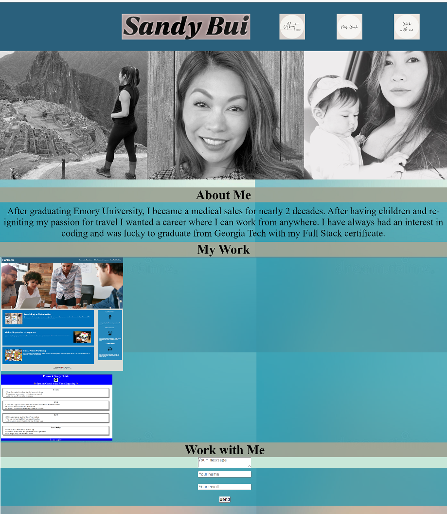

<h1 align="center">Welcome to Sandy Bui's Portofolio 👋</h1>
<p>
This project was built in order to showcase what I have learned so far from my full stack bootcamp.  By the end of the course I should be able to have a final product that will display all of my work samples in a clean and professional way.  This should help employers see that I'm a fantastic candidate for their company.
</p>

### 🏠 Homepage
https://stbuiemory.github.io/Sandy-Bui-Portfolio/

## Installation

```sh
- We were not given a starter code and had to create it from scratch.
- The app needed to show my name, picture and links to sections (about me, work, and contact).
- I needed to also make sure my website can be viewed on other screens and devices with a responsive layout.
```

## Usage

```sh
- Below is a screenshot of my portfolio.
```


## Testing

```sh
- The website launched well; however, it did not have a good responsive layout. Also, I had several issues with using flexbox feature.  Thereby, I will need to speak with a tutor to understand why and improve the website.
```

## 🤝 Contributing

There were no contributors on this project.

## 📝 License

MIT License

Copyright (c) 2023 Sandy Bui

Permission is hereby granted, free of charge, to any person obtaining a copy of this software and associated documentation files (the "Software"), to deal in the Software without restriction, including without limitation the rights to use, copy, modify, merge, publish, distribute, sublicense, and/or sell copies of the Software, and to permit persons to whom the Software is furnished to do so, subject to the following conditions:

The above copyright notice and this permission notice shall be included in all copies or substantial portions of the Software.

THE SOFTWARE IS PROVIDED "AS IS", WITHOUT WARRANTY OF ANY KIND, EXPRESS OR IMPLIED, INCLUDING BUT NOT LIMITED TO THE WARRANTIES OF MERCHANTABILITY, FITNESS FOR A PARTICULAR PURPOSE AND NONINFRINGEMENT. IN NO EVENT SHALL THE AUTHORS OR COPYRIGHT HOLDERS BE LIABLE FOR ANY CLAIM, DAMAGES OR OTHER LIABILITY, WHETHER IN AN ACTION OF CONTRACT, TORT OR OTHERWISE, ARISING FROM, OUT OF OR IN CONNECTION WITH THE SOFTWARE OR THE USE OR OTHER DEALINGS IN THE SOFTWARE.